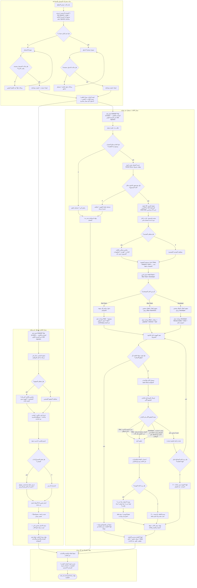

```mermaid
flowchart TD
  subgraph START["بداية مشتركة: الوصول والمصادقة"]
    direction TB
    VISITOR["زائر يكتب دومين الموقع"] --> HOME["الصفحة الرئيسية: تعريف + Get Started + Login + توضيح أن النسخة الحالية حلقة Injection متكاملة"]
    HOME --> HAS_ACCOUNT{"هل لدى الزائر حساب؟"}

    HAS_ACCOUNT -->|"لا"| REGISTER["نموذج التسجيل"]
    HAS_ACCOUNT -->|"نعم"| LOGIN["نموذج تسجيل الدخول"]

    REGISTER --> REG_VALID{"هل بيانات التسجيل صحيحة وغير مكررة؟"}
    REG_VALID -->|"لا"| REG_ERROR["رسالة خطأ عند الحقل المعني"]
    REG_ERROR --> REGISTER
    REG_VALID -->|"نعم"| CREATE_ACCOUNT["إنشاء حساب + جلسة مصادقة"]

    LOGIN --> LOGIN_VALID{"هل بيانات الدخول صحيحة؟"}
    LOGIN_VALID -->|"لا"| LOGIN_ERROR["رسالة دخول فاشل + تسجيل تدقيق"]
    LOGIN_ERROR --> LOGIN
    LOGIN_VALID -->|"نعم"| SESSION["إنشاء جلسة مصادقة"]

    CREATE_ACCOUNT --> DASHBOARD["لوحة البداية: مسار التعلم + مسار اللابات + التقدم — الدخول لأي مسار مباشرة"]
    SESSION --> DASHBOARD
  end

  subgraph LEARNING_PATH["مسار التعلم: مستقل حتى نهايته"]
    direction TB
    DASHBOARD --> LP_CATEGORY["اختيار فئة OWASP Top 10:2025 — المتاحة بالكامل في النسخة الأولى: A05 Injection"]
    LP_CATEGORY --> LP_SCENE["مشهد قصصي: صابر في مرحلة ما قبل التوظيف"]

    LP_SCENE --> LP_SKIP{"هل يتخطى المشهد؟"}
    LP_SKIP -->|"نعم"| LP_SUMMARY["ملخص مكافئ: المرحلة + الشخصية + المهمة بدون كشف إجابة"]
    LP_SKIP -->|"لا"| LP_WATCH["مشاهدة المشهد القصصي"]

    LP_SUMMARY --> LP_EXPLAIN["شرح تقني مكتوب: فصحى واضحة + مصطلح إنجليزي عند الحاجة"]
    LP_WATCH --> LP_EXPLAIN

    LP_EXPLAIN --> LP_VIDEO["فيديو تعليمي خارجي مدمج"]
    LP_VIDEO --> LP_VIDEO_FAIL{"هل فشل الفيديو أو غاب المصدر؟"}
    LP_VIDEO_FAIL -->|"نعم"| LP_FALLBACK["عرض رابط بديل/مصدر موثوق + التنبيه أن النص هو المرجع"]
    LP_VIDEO_FAIL -->|"لا"| LP_CONTINUE["استمرار الدرس"]

    LP_FALLBACK --> LP_QUIZ["اختبار قصير 3-5 أسئلة اختيار من متعدد"]
    LP_CONTINUE --> LP_QUIZ

    LP_QUIZ --> LP_FEEDBACK["تغذية راجعة: صحيح/خطأ + تفسير موجز"]
    LP_FEEDBACK --> LP_SELF["نتيجة الاختبار فحص ذاتي — ليست بوابة فتح اللاب"]
    LP_SELF --> LP_DONE["نهاية مسار التعلم: حفظ تقدم القراءة والاختبار والأحداث السلوكية"]
  end

  subgraph LABS_PATH["مسار اللابات: مستقل حتى نهايته"]
    direction TB
    DASHBOARD --> LAB_CATEGORY["اختيار فئة OWASP Top 10:2025 — المتاحة بالكامل في النسخة الأولى: A05 Injection"]
    LAB_CATEGORY --> LAB_REQUEST["طلب بدء جلسة معمل"]

    LAB_REQUEST --> LAB_AUTH{"هل الخادم صدّق الحساب وسمح ببدء الجلسة؟"}
    LAB_AUTH -->|"لا"| LAB_DENY["رفض آمن + تسجيل تدقيق"]
    LAB_DENY --> LAB_ERROR_END["نهاية استثنائية: تعذر بدء المعمل"]

    LAB_AUTH -->|"نعم"| LAB_PROVISION["خدمة المعمل تنشئ حاوية Docker مؤقتة معزولة شبكيًا"]
    LAB_PROVISION --> LAB_PROV_OK{"هل نجح تجهيز الحاوية خلال الحد المسموح؟"}
    LAB_PROV_OK -->|"لا"| LAB_PROV_FAIL["تسجيل فشل التجهيز + تنظيف جزئي إن وجد"]
    LAB_PROV_FAIL --> LAB_ERROR_END

    LAB_PROV_OK -->|"نعم"| LAB_LIMITS["تفعيل الحدود: 60 دقيقة افتراضيًا، 120 حدًا أقصى، 2GB RAM، حتى 10 متزامنين"]
    LAB_LIMITS --> LAB_INTRO["مقدمة قصصية: حادث داخل نور تك بعد انضمام صابر"]

    LAB_INTRO --> LAB_SKIP{"هل يتخطى المقدمة؟"}
    LAB_SKIP -->|"نعم"| LAB_CTX["ملخص سياقي مكافئ: الحادث + الهدف + المعلومات الضرورية بدون حل"]
    LAB_SKIP -->|"لا"| LAB_WATCH["مشاهدة المقدمة القصصية"]

    LAB_CTX --> LAB_DIFF["اختيار مستوى الصعوبة: Easy / Medium / Hard — يحدد التلميحات فقط"]
    LAB_WATCH --> LAB_DIFF

    LAB_DIFF --> LAB_ROLE["اختيار الدور: Red Team / Blue Team / Developer"]
    LAB_ROLE --> LAB_ROLE_TYPE{"أي دور اختار المستخدم؟"}

    LAB_ROLE_TYPE -->|"Red Team"| RED_ENTER["دخول مباشر إلى مهمة الاكتشاف"]
    RED_ENTER --> RED_TOOLS["مساحة عمل Red: متصفح + أدوات المطور + ttyd + curl/nmap عند الحاجة"]

    LAB_ROLE_TYPE -->|"Blue Team"| BLUE_TRANS["مشهد انتقال: البطل يستعين بزميل Blue Team/SOC"]
    BLUE_TRANS --> BLUE_TOOLS["مساحة عمل Blue: سجلات + grep/tail + Adminer + ttyd"]

    LAB_ROLE_TYPE -->|"Developer"| DEV_TRANS["مشهد انتقال: البطل يستعين بزميل Developer"]
    DEV_TRANS --> DEV_TOOLS["مساحة عمل Developer: Monaco Editor + linter + اختبارات آلية"]

    RED_TOOLS --> LAB_TASK["تنفيذ المهمة داخل الحاوية المعزولة"]
    BLUE_TOOLS --> LAB_TASK
    DEV_TOOLS --> LAB_TASK

    LAB_TASK --> LAB_TIMEOUT{"هل انتهت مهلة الجلسة أو انقطع الاتصال؟"}
    LAB_TIMEOUT -->|"نعم"| LAB_EXPIRED["حفظ آمن للنتائج الوسيطة + إنهاء الجلسة بدون نقاط غير موثقة"]
    LAB_EXPIRED --> LAB_CLEANUP
    LAB_TIMEOUT -->|"لا"| LAB_EVIDENCE["تسجيل الأدلة والأحداث السلوكية إضافةً فقط"]

    LAB_EVIDENCE --> LAB_SUBMIT["إرسال النتيجة إلى الخادم للتحقق الآلي"]
    LAB_SUBMIT --> LAB_VERIFY{"نتيجة التحقق الآلي في الخادم"}

    LAB_VERIFY -->|"Red: ثبتت النتيجة الأمنية داخل النطاق"| LAB_PASS["تحقق ناجح"]
    LAB_VERIFY -->|"Blue: اكتملت سلسلة استنتاج من خطوتين إلى ثلاث"| LAB_PASS
    LAB_VERIFY -->|"Developer: نجحت اختبارات الإصلاح ومنعت الحالة غير الآمنة مع الحفاظ على الوظائف"| LAB_PASS

    LAB_VERIFY -->|"فشل أو نقص دليل"| LAB_FEEDBACK["تغذية راجعة تعليمية محددة"]
    LAB_FEEDBACK --> LAB_RETRY{"هل يريد إعادة المحاولة قبل انتهاء الجلسة؟"}
    LAB_RETRY -->|"نعم"| LAB_TASK
    LAB_RETRY -->|"لا"| LAB_INCOMPLETE["إنهاء المهمة بدون نقاط — لا احتساب عند الفشل"]

    LAB_PASS --> LAB_POINTS["احتساب النقاط والإنجازات في الخادم مع منع التكرار"]
    LAB_POINTS --> LAB_JOURNAL{"هل يريد كتابة اليومية؟"}

    LAB_JOURNAL -->|"نعم"| LAB_JOURNAL_FORM["تعبئة 4 أسئلة: ماذا حدث؟ لماذا حدث؟ ماذا فعلت؟ ماذا تعلمت؟"]
    LAB_JOURNAL -->|"لا"| LAB_JOURNAL_SKIP["وسم الحلقة: بلا يومية — لا حجب تقدم ولا خصم نقاط"]

    LAB_JOURNAL_FORM --> LAB_JOURNAL_SAVED["حفظ اليومية + منح نقاط اختيارية إن وُجدت"]
    LAB_JOURNAL_SAVED --> LAB_DONE["نهاية مسار اللاب: حفظ النتيجة والتقدم والأدلة"]
    LAB_JOURNAL_SKIP --> LAB_DONE
    LAB_INCOMPLETE --> LAB_DONE

    LAB_DONE --> LAB_CLEANUP["إنهاء الجلسة وتدمير الحاوية تلقائيًا + سجل تدقيق + عامل تنظيف خلفي عند الحاجة"]
  end

  subgraph COMMON_FINISH["نهاية مشتركة بعد كل مسار"]
    direction TB
    LP_DONE --> SERVER_SAVE["حفظ الحالة والتقدم والأحداث في الخادم"]
    LAB_CLEANUP --> SERVER_SAVE
    LAB_ERROR_END --> SERVER_SAVE

    SERVER_SAVE --> PROFILE["تحديث لوحة البداية: التقدم + الإنجازات + إعدادات لوحة الصدارة الاختيارية"]
    PROFILE --> USER_END(["نهاية رحلة المستخدم في هذه الجلسة"])
  end
```